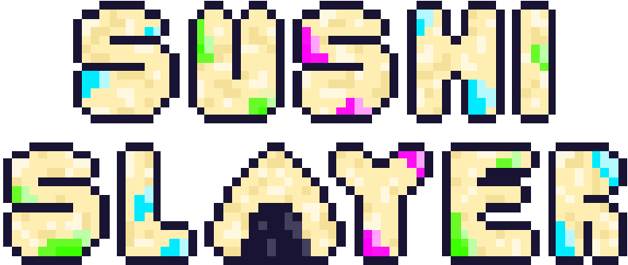

# Sushi Slayer

In a renowned restaurant on Nishihara Street, Shibuya, where the aroma of traditional Japanese delicacies fills the air, a heroic bao sets out on an epic battle against mischievous sushis. Armed with an arsenal of weapons and extraordinary abilities, our fluffy protagonist strives to reclaim its rightful throne in the culinary kingdom of the restaurant. Brace yourself for an appetizing showdown unlike any other!

This is a game being developed by students from <a href="https://www.imagecampus.edu.ar/">Image Campus</a>

   

## Credits

- **Nicolas Ramos Mari** - *Programming*
- **Facundo Santos** - *Programming*
- **Maria Elisa Gonda** - *Art*
- **Candela Vargas Ernalz** - *Art*
- **Nicolas Funes** - *Audio Implementation*
- **Elise Grey** - *Music*
- **Nicolas Palavecino** - *Audio Design*
- **Nicolas Nahuel Carnota** - *Testing*
- **Sebastian Cretella** - *Testing*
- **Valentin Andres Gamero** - *Testing*
- **Mateo Taylor** - *Testing*

This game was also possible thanks to the support of these professors:

- **Sergio Baretto**
- **Juan Pablo Varela Aloisio**
- **Ramiro Cabrera**
- **Eugenio Taboada**
- **Nazareno Rivero**
- **Lucía Inés Patetta**

## Acknowledgements

- **Federico Barra**
- **Franco Guerra**
- **Silvina Lemos Hoffmann**

OTRAS PERSONAS A LAS QUE QUIERAN AGRADECERLES ACÁ, SINO SACAR ESTE TEXTO

## Links

Download it from itch.io: https://nicorm.itch.io/sushi-slayer
